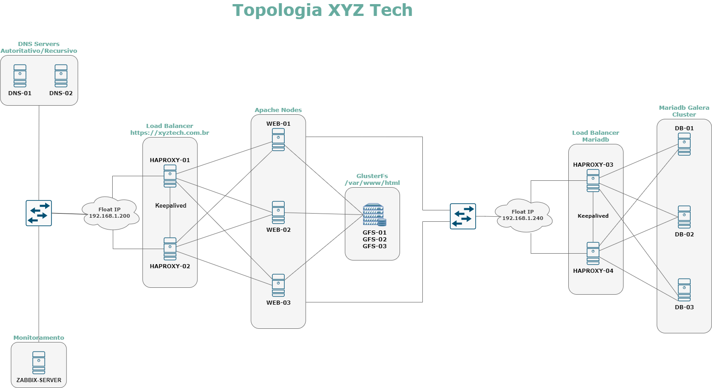

Lab Zabbix
=========

Lab utilizando Ansible para automatizar a instalação do Zabbix e seus agentes nos servidores da Topologia abaixo.

Topologia
------------

O lab é composto por:

- Servidores DNS
    - Bind
    - Autoritativo
    - Recursivo
- Load Balancers
    - Haproxy
    - SSL Termination
    - HTTPS Redirection
    - Round Robin
    - Keepalived
- Web Servers
    - Apache
    - PHP
- Storage
    - GlusterFS
    - Distributed Replicated
- Database
    - Maridb Galera Cluster